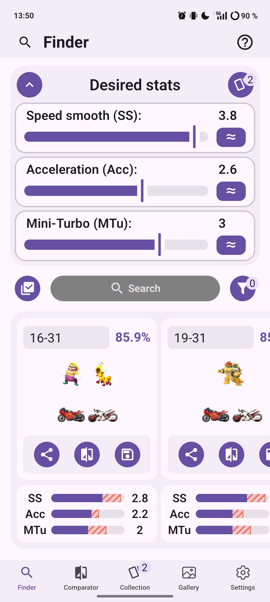
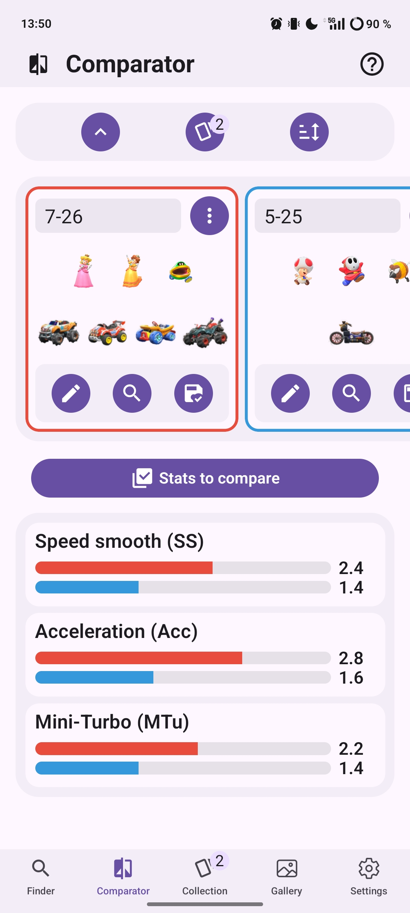
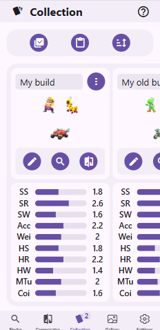
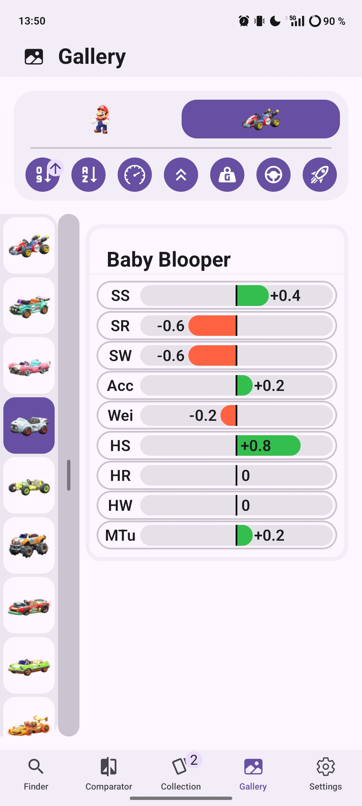
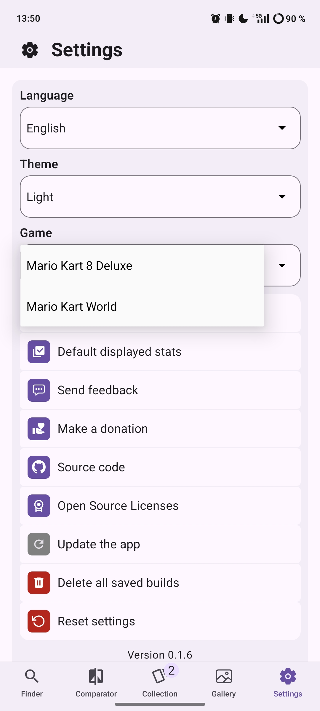

# Mario Kalc

[](https://reactnative.dev/)  
[]()  
[](./LICENSE)  
[](../../issues)  
[](../../stargazers)  
[](https://github.com/ClementR22/MarioKalc/releases)

---

## 🎮 Description

**Mario Kalc** is an **unofficial mobile application** designed to help players  
**create, compare, and optimize their builds** in _Mario Kart 8 Deluxe_ and _Mario Kart World.

A **build** consists of:
- Character  
- Body (kart, bike, or ATV)

For Mario Kart 8 Deluxe, it also includes:
- Wheels  
- Glider
and Body includes sport bike too.

The goal is simple: **find the best balance between the stats you want**, depending on your playstyle.

Whether you are a casual player or a competitive racer, this app helps you make **data-driven choices**, not guesses.

---

## 🌍 Languages

The app is available in:
- 🇬🇧 **English**
- 🇫🇷 **French** (Français)

The language is automatically detected based on your device settings.

---

## ❓ Why this app?

In Mario Kart:
- Comparing multiple builds is **time-consuming**
- The real impact of each part is not always clear
- Some stats are **hidden**

This app centralizes all statistics and lets you **quickly test and compare builds**.

---

## 🚀 Features

- 🧩 Build creation
- 📊 Clear and readable statistics
- 🔍 Build comparison
- ⭐ Save your favorite builds
- 📱 Clean and fast mobile UI

---

## 📸 Screenshots

<p align="center">





</p>

---

## 📥 Download

Android APK available here:  
🔗 [Latest Release](https://github.com/ClementR22/MarioKalc/releases)

The app is not yet available on the Google Play Store.

---

## 📦 Installation (Developers)

### Requirements

- Node.js
- npm
- Expo
- Android SDK (for local Android builds)

### Run the project
```bash
git clone https://github.com/ClementR22/MarioKalc.git
cd MarioKalc

npm install
npx expo start
```

### Android build (optional)
```bash
npx expo run:android
```

---

## 🛠️ Tech Stack

- React Native
- Expo
- JavaScript / TypeScript
- Android-first

---

## ⚙️ How does it work?

1. Select the stats you want for your build
2. The app finds matching builds
3. Results are displayed in a clear and comparable way
4. Builds can be saved or compared

---

## 📊 Data source

All statistics are based on a community-maintained Google Sheet, widely used by the Mario Kart community:  
https://docs.google.com/spreadsheets/d/1BtHeFAEwL1MLND-l7KZz_Zg4wZWC2YIikbyweocqwSs

---

## ⚠️ Current limitations

- ❌ No iOS version yet 
- 📱 Android only

---

## 🗺 Roadmap

- [x] Stable Android version
- [ ] Google Play Store release 
- [ ] iOS version

---

## ❓ FAQ

### Is this app official?
❌ No. This is an independent community project.

### Are the stats accurate?
✅ Yes, they are based on trusted community data.

### Is the app free?
✅ Yes, completely free.

### Will there be an iOS version?
🔜 Planned, but no ETA yet.

---

## ⚠️ Nintendo Disclaimer

This application is not affiliated with, endorsed, sponsored, or approved by Nintendo.  
Mario Kart, Mario Kart 8 Deluxe, and Mario Kart World are trademarks of Nintendo.

---

## 🤝 Contributing

Contributions are welcome!

- 🐛 Report bugs via [issues](../../issues)
- 💡 Suggest new features
- 🔧 Open a pull request

---

## 📬 Contact & Feedback

https://forms.gle/q7WQTsTkjqVr7n9V9

---

## ☕ Support the project

If you enjoy this app and want to support its development, you can make a donation:  
https://www.paypal.com/donate/?hosted_button_id=7YMYSGASUL7A8

Thank you for your support ❤️

---

## 📜 License

MIT License  
See [LICENSE](./LICENSE) for details.
